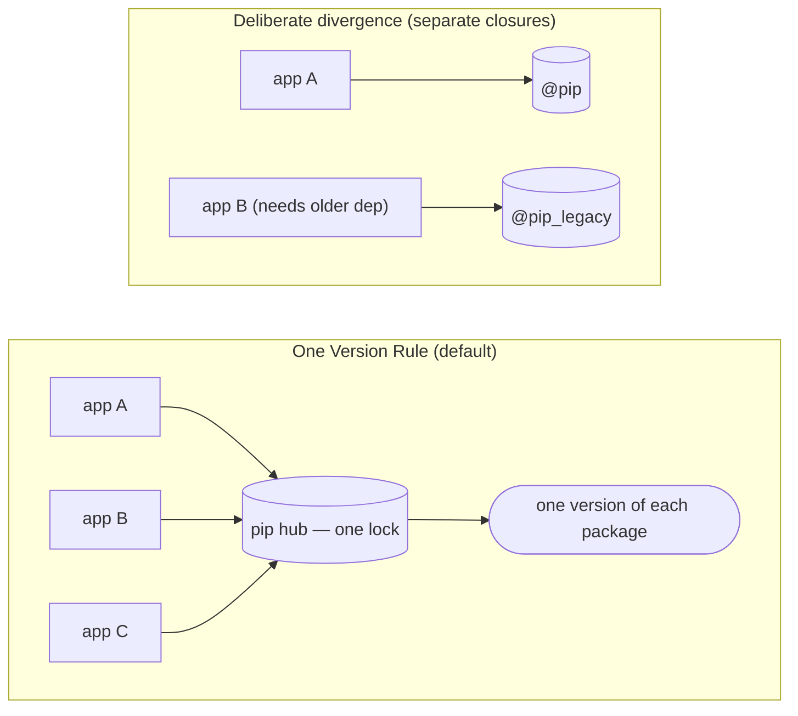
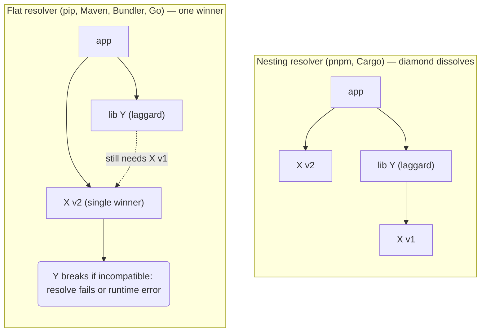
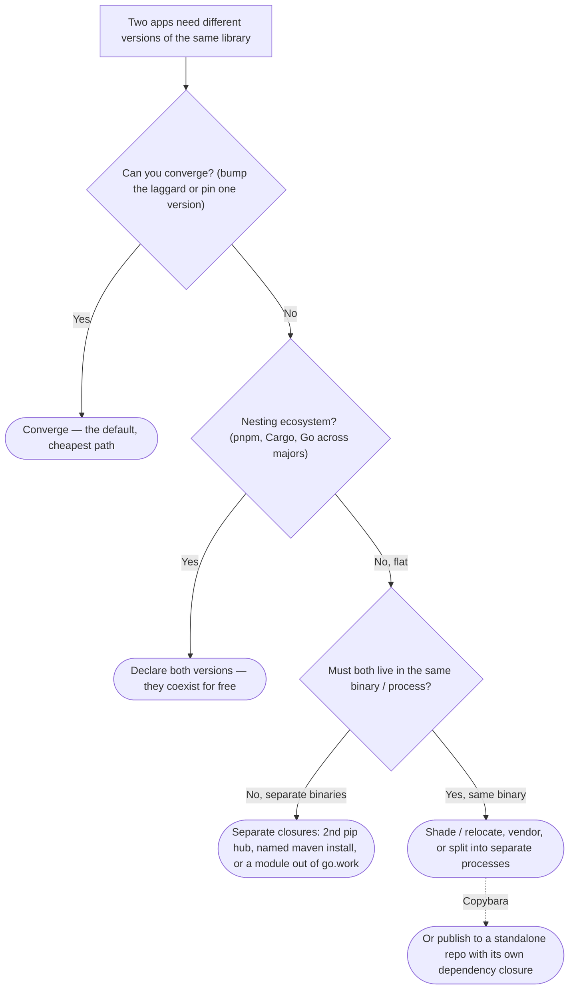

# Dependency Versioning & the One Version Rule

This monorepo manages third-party dependencies with **one resolved version per ecosystem** —
the *One Version Rule* (1VR). For each language, external packages flow through a single shared
"hub": one `pip` lock, one `maven_install.json`, one `go.work`/`go.sum`, one `pnpm-lock.yaml`,
one `Cargo.lock`, one `Gemfile.lock`. Bazel builds everything in that hub against the same
versions.

1VR is a feature, not a limitation. It keeps the build graph small, makes an upgrade a single
decision instead of a per-app negotiation, and surfaces conflicts at build time rather than as
runtime surprises in production. But it raises the obvious question this guide answers:

> What happens when two apps in the same language genuinely need *different* versions of the
> same library — or when one app is held back because a transitive dependency it relies on
> hasn't upgraded yet?

This page is the language-agnostic model. For the exact mechanics — and the escape hatches — in
your stack, see the [per-language pages](#per-language-guides) below.

## The mental model: two kinds of resolver

Every package manager falls into one of two camps, and which camp a language is in decides what
"different versions" even means:

- **Nesting resolvers** keep multiple versions side by side. A diamond just dissolves: a library
  gets `X@1`, your app gets `X@2`, and both are built. The cost is duplication, plus the rare
  "two types that look identical but aren't" error when a value of one version crosses an API
  boundary expecting the other.
- **Flat resolvers** allow exactly one version of a package in a given closure. Two incompatible
  requirements are a hard conflict: one version must win, and a single lagging transitive
  dependency can hold the whole tree back.

Your per-language page states which camp that language is in and what it does on conflict.

## The diamond / transitive-lag problem

The painful version of this isn't "app A wants v1, app B wants v2" — that's a deliberate choice.
It's the *involuntary* one: app B needs `X@2`, but library `Y` (which some app depends on) still
pins `X@1` because `Y` hasn't cut a release that widens its constraint.

- In a **nesting** ecosystem this is a non-event — `Y` keeps its `X@1`, app B gets `X@2`.
- In a **flat** ecosystem the laggard effectively pins everyone: the resolver either fails
  outright, or silently picks one version and you discover the mismatch as a runtime error. This
  is exactly the pain 1VR makes you feel *early*, at build time, instead of in prod.

## Decision tree: when versions diverge

1. **Can you converge?** Prefer it, every time. Bump the lagging consumer, or force the shared
   dependency to one version and run the tests. Convergence is usually possible and always
   cheaper than maintaining parallel versions. This is the default and the reason 1VR exists.
2. **Is it a nesting ecosystem?** (JavaScript/pnpm, Rust/Cargo, Go across major versions.) Then
   divergence is essentially free — declare the versions you need and move on.
3. **Do you genuinely need divergence in a flat ecosystem?** Give each app its own closure: a
   second `pip` hub, a named `maven` install, or a module pulled out of `go.work`. The two apps
   stop sharing that dependency. See the per-language page for the exact wiring.
4. **Must both versions live in the *same* binary?** (one JVM classpath, one Python interpreter,
   one linked binary.) Separate hubs won't save you here — you need shading/relocation,
   vendoring, or to split the work into separate processes.

## Detecting a conflict

Start by asking the resolver who pulled a package in and which version won. The command is
language-specific — each per-language page lists it (`pnpm why`, `go mod why`, `cargo tree -d`,
`bundle why`, the Maven dependency tree, etc.). In every case the goal is the same: find the
*laggard* constraint, then decide converge vs. isolate using the tree above.

## Per-language guides
- [Swift](swift.md) — `rules_swift` + Swift packages (one-version)

